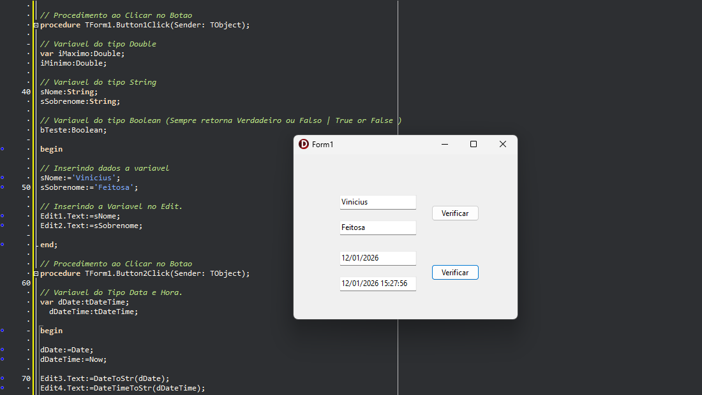

📌 Delphi – Tipos de Variáveis

Este repositório é um projeto de estudo em Delphi criado para praticar e entender melhor os tipos de variáveis da linguagem Object Pascal.

A ideia aqui foi montar um projeto simples, com formulário, para testar na prática a declaração e o uso de diferentes tipos de variáveis, algo comum no dia a dia de quem está começando ou revisando conceitos em Delphi.

✨ Objetivo

Reforçar conceitos básicos da linguagem

Servir como material de consulta futura

Manter um histórico de estudos no GitHub.

Projeto feito apenas para fins de aprendizado e prática.

.
